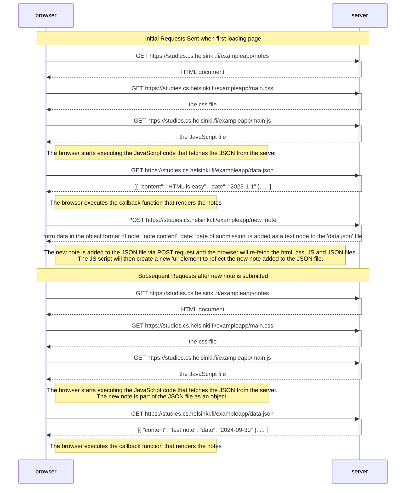

## Diagram showing how Traditional Web Apps Work when submitting a new Note

```mermaid
sequenceDiagram
    participant browser
    participant server

    Note over browser,server: Initial Requests Sent when first loading page

    browser->>server: GET https://studies.cs.helsinki.fi/exampleapp/notes
    activate server
    server-->>browser: HTML document
    deactivate server

    browser->>server: GET https://studies.cs.helsinki.fi/exampleapp/main.css
    activate server
    server-->>browser: the css file
    deactivate server

    browser->>server: GET https://studies.cs.helsinki.fi/exampleapp/main.js
    activate server
    server-->>browser: the JavaScript file
    deactivate server

    Note right of browser: The browser starts executing the JavaScript code that fetches the JSON from the server

    browser->>server: GET https://studies.cs.helsinki.fi/exampleapp/data.json
    activate server
    server-->>browser: [{ "content": "HTML is easy", "date": "2023-1-1" }, ... ]
    deactivate server

    Note right of browser: The browser executes the callback function that renders the notes

    browser->>server: POST https://studies.cs.helsinki.fi/exampleapp/new_note
    activate server
    server-->>browser: form data in the object format of note: 'note content', date: 'date of submission' is added as a text node to the 'data.json' file
    deactivate server

    Note right of browser: The new note is added to the JSON file via POST request and the browser will re-fetch the html, css, JS and JSON files. <br> The JS script will then create a new 'ul' element to reflect the new note added to the JSON file.

    Note over browser,server: Subsequent Requests after new note is submitted

    browser->>server: GET https://studies.cs.helsinki.fi/exampleapp/notes
    activate server
    server-->>browser: HTML document
    deactivate server

    browser->>server: GET https://studies.cs.helsinki.fi/exampleapp/main.css
    activate server
    server-->>browser: the css file
    deactivate server

    browser->>server: GET https://studies.cs.helsinki.fi/exampleapp/main.js
    activate server
    server-->>browser: the JavaScript file
    deactivate server

    Note right of browser: The browser starts executing the JavaScript code that fetches the JSON from the server. <br> The new note is part of the JSON file as an object.

    browser->>server: GET https://studies.cs.helsinki.fi/exampleapp/data.json
    activate server
    server-->>browser: [{ "content": "test note", "date": "2024-09-30" }, ... ]
    deactivate server

    Note right of browser: The browser executes the callback function that renders the notes

```