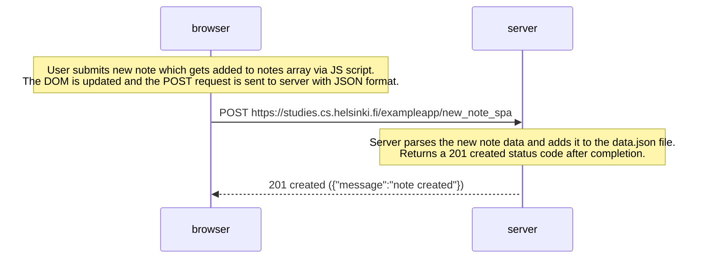

## Diagram showing how SPA work when submitting a new Notes

```mermaid
sequenceDiagram
    participant browser
    participant server

    Note over browser: User submits new note which gets added to notes array via JS script.<br> The DOM is updated and the POST request is sent to server with JSON format.

    browser->>server: POST https://studies.cs.helsinki.fi/exampleapp/new_note_spa
    Note over server: Server parses the new note data and adds it to the data.json file. <br> Returns a 201 created status code after completion.
    activate server
    server-->>browser: 201 created ({"message":"note created"})
    

```